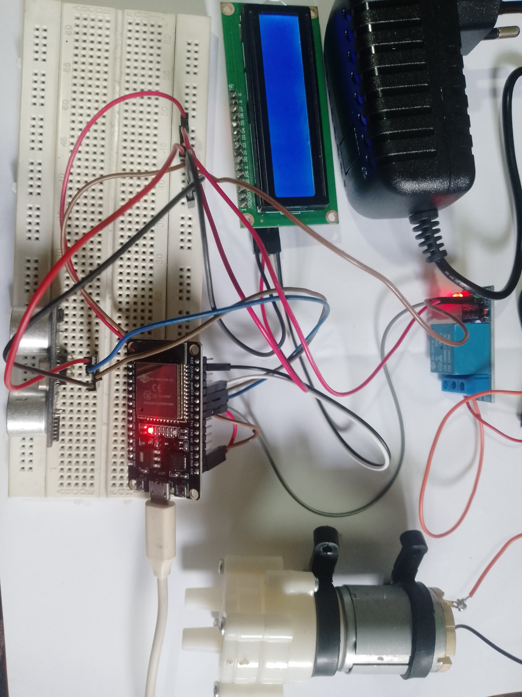

# 💧 Smart Water Tank Monitoring System


An IoT-based **Smart Water Tank Monitoring System** developed as a **Year 1 Semester 1 (Y1S1) Group Project** for the **Fundamentals of Computing (IoT)** module at the **Sri Lanka Institute of Information Technology (SLIIT).**

The project demonstrates how IoT and embedded systems can automate water level monitoring and water pump control, reducing water wastage while preventing tank overflow.

---

# 📑 Table of Contents

- Project Overview
- Key Features
- Technologies Used
- Hardware Components
- System Workflow
- Project Gallery
- Objectives
- Learning Outcomes
- Academic Information
- Future Improvements
- License

---

# 📌 Project Overview

The Smart Water Tank Monitoring System continuously measures the water level inside a storage tank using an **HC-SR04 Ultrasonic Sensor**.

An **ESP32 Development Board** processes the sensor readings and displays the current water level on a **16×2 LCD Display**.

When the water level drops below a predefined threshold, the system automatically activates the water pump through a **Relay Module**. Once the tank reaches the required water level, the pump is automatically switched OFF, preventing overflow and minimizing water wastage.

This project provided valuable hands-on experience in IoT system development, embedded programming, hardware integration, and automation.

---

# ✨ Key Features

- 📏 Real-time water level monitoring
- 💧 Automatic water pump control
- 📺 Live water level display on LCD
- ⚡ Relay-based automation
- 🚨 Low water level detection
- 🌊 Overflow prevention
- 🔄 Continuous monitoring
- 🌱 Water conservation
- 🔌 Embedded hardware integration
- 🤖 IoT-based automation

---

# 🛠 Technologies Used

- ESP32 Development Board
- Arduino IDE
- Embedded C++
- Internet of Things (IoT)

---

# 🔧 Hardware Components

- ESP32 Development Board
- HC-SR04 Ultrasonic Sensor
- 16×2 LCD Display
- Single Channel Relay Module
- DC Water Pump
- Breadboard
- Jumper Wires
- External Power Supply
- Water Tank Prototype

---

# ⚙️ System Workflow

```text
           Water Tank
               │
               ▼
    HC-SR04 Ultrasonic Sensor
               │
               ▼
      ESP32 Development Board
               │
      ┌────────┴────────┐
      ▼                 ▼
16×2 LCD Display   Relay Module
                          │
                          ▼
                     Water Pump
```

---

# 📷 Project Gallery

## 🏗 Final Prototype


---

## 📸 Prototype - Alternate View


---

## 🔌 Hardware Setup



# 🎯 Project Objectives

- Automate household water tank management
- Monitor water levels accurately
- Prevent tank overflow
- Reduce water wastage
- Improve efficiency through automation
- Apply IoT concepts to solve a real-world problem
- Gain practical experience with embedded systems

---

# 📚 Learning Outcomes

Through this project, we gained practical experience in:

- Internet of Things (IoT)
- ESP32 Programming
- Arduino IDE
- Embedded Systems
- Sensor Integration
- Hardware Interfacing
- Relay Control
- Automation
- Team Collaboration
- Problem Solving

---

# 📊 Project Summary

| Item | Details |
|------|---------|
| **Project Name** | Smart Water Tank Monitoring System |
| **Project Type** | Group Project |
| **Academic Year** | Year 1 Semester 1 (Y1S1) |
| **Module** | Fundamentals of Computing (IoT) |
| **Domain** | Internet of Things (IoT) |
| **Institution** | Sri Lanka Institute of Information Technology (SLIIT) |
| **Platform** | ESP32 |
| **Language** | Embedded C++ |
| **IDE** | Arduino IDE |

---

# 🚀 Future Improvements

Possible enhancements include:

- 📱 Mobile Application
- ☁️ Cloud Integration
- 📊 Real-time Dashboard
- 📡 Wi-Fi Monitoring
- 📈 Historical Water Usage Analytics
- 🔔 SMS & Email Notifications
- 📲 Blynk Mobile Integration
- 🌐 Web Dashboard

---

# 👨‍💻 Developed As

**Year 1 Semester 1 (Y1S1) Group Project**

Fundamentals of Computing (Internet of Things)

Sri Lanka Institute of Information Technology (SLIIT)

---

# ⭐ Repository Highlights

- IoT Automation Project
- ESP32 Based System
- Water Pump Automation
- Embedded Systems
- Ultrasonic Sensor Integration
- LCD Display Interface
- Relay Module Control
- Real-world Engineering Solution

---

# 📄 License

This repository is published for **educational and portfolio purposes only.**

Feel free to explore the project and learn from the implementation.

---
